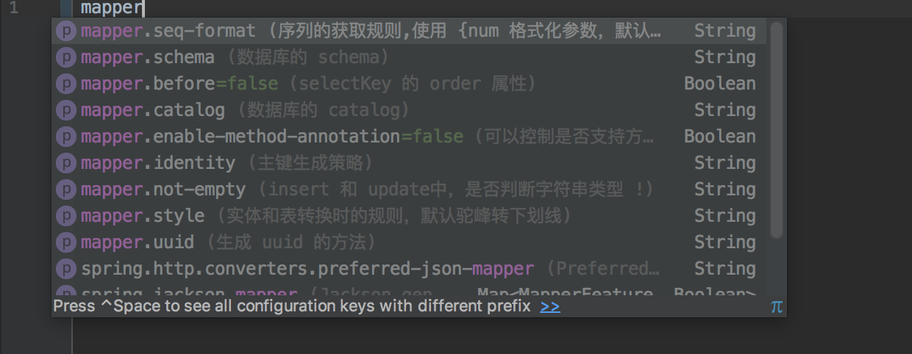

# Mybatis-Mapper-Pagehelper
整合了 Mybatis、通用 Mapper、PageHelper 分页插件的 Spring Boot Starter 模块
# 依赖模块
1. Mybatis
2. 通用 Mapper
3. PageHelper 分页插件
4. Druid 数据源
# 如何使用
1. 添加依赖
```
<dependency>
    <groupId>ml.jjandxa</groupId>
    <artifactId>db-spring-boot-starter</artifactId>
    <version>0.0.3</version>
</dependency>
```
2. 添加数据源配置、mybatis 配置、分页配置
```
# 数据源配置
spring:
  datasource:
    druid:
      url: jdbc:mysql://localhost:3306/test?useUnicode=true&characterEncoding=UTF-8&useSSL=false
      username: root
      password: "0000000"
      driver-class-name: com.mysql.jdbc.Driver
      max-active: 20
      initial-size: 1
      max-wait: 60000
      min-idle: 1
      time-between-eviction-runs-millis: 60000
      min-evictable-idle-time-millis: 300000
      validation-query: select 'x'
      test-while-idle: true
      test-on-borrow: false
      test-on-return: false
      pool-prepared-statements: true
      max-open-prepared-statements: 20
      filters: stat, wall
      # 监控配置
      web-stat-filter:
        url-pattern: /*
        exclusions: "*.js,*.gif,*.jpg,*.png,*.css,*.ico,/druid/*"
      stat-view-servlet:
        url-pattern: /druid/*
        reset-enable: false
        login-username: sysadmin
        login-password: "000000"
# mybatis 配置
mybatis:
  type-aliases-package: ml.jjandxa.db.example.mapper.model
  mapper-locations: classpath:mybatis/mapper/*.xml
# mapper 配置
mapper:
  identity: select uuid()
  before: true
```
# 生成 Mapper 接口、Mapper XML、Model
调用 `MapperGenerator.genMapper("/generatorConfig.xml")` 方法，传入 generatorConfig 配置文件路径，可参考 example 项目的配置，
Mapper 接口需要手动加上 @Mapper 注解才能被 Mybatis 扫描到
# IDE 支持

# 替换数据源
如果需要替换成其他数据源，排除以下依赖，并且修改 **application.yml** 文件的数据源配置
```
<dependency>
    <groupId>com.alibaba</groupId>
    <artifactId>druid-spring-boot-starter</artifactId>
</dependency>
```